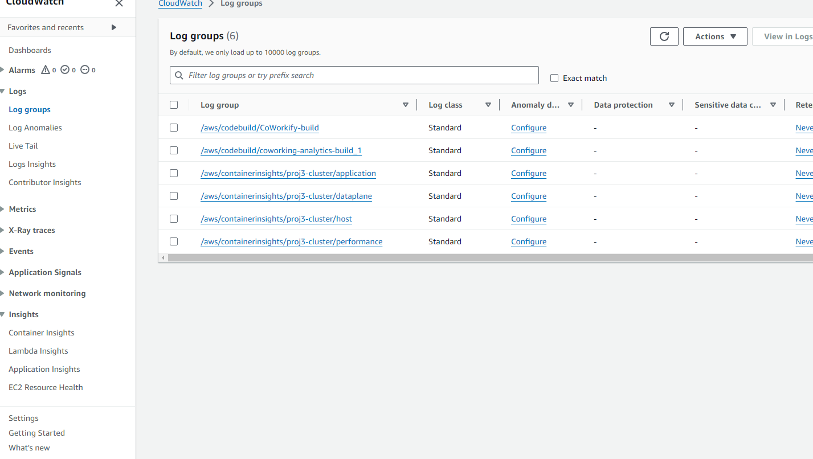

# Coworking Space Service Extension
The Coworking Space Service is a set of APIs that enables users to request one-time tokens and administrators to authorize access to a coworking space. This service follows a microservice pattern and the APIs are split into distinct services that can be deployed and managed independently of one another.

For this project, you are a DevOps engineer who will be collaborating with a team that is building an API for business analysts. The API provides business analysts basic analytics data on user activity in the service. The application they provide you functions as expected locally and you are expected to help build a pipeline to deploy it in Kubernetes.

# Step 1: Set Up a Postgres Database with Helm Chart
Pre-requisites:

Have Kubernetes cluster ready.
Have kubectl installed and configured to interact with your cluster.
Have Helm installed.
Instructions:

# Install Helm:
curl -LO https://get.helm.sh/helm-v3.12.2-linux-amd64.tar.gz
Add the Bitnami Helm Repository:
helm repo add bitnami https://charts.bitnami.com/bitnami
helm repo update
Install the PostgreSQL Chart:
helm install my-postgres bitnami/postgresql
# Verify the Installation:
helm list
kubectl get pods
Get the PostgreSQL Connection Details:
export POSTGRES_PASSWORD=$(kubectl get secret --namespace default my-postgres-postgresql -o jsonpath="{.data.postgres-password}" | base64 --decode)
Create a Dockerfile for the Python Application
Dockerfile Dockerfile

# Write a Build Pipeline with AWS CodeBuild
buildspec File buildspec

BulidCode history BulidCode history

Create Kubernetes Service and Deployment
List Services

kubectl get svc
kubectl describe svc
List Services List Services List Describe Services Kubernetes List Describe Services Kubernetes List Describe Services Postgres DB List Describe Services Postgres DB List Describe Services Project3 API List Describe Services Project3 API

List Pods

kubectl get pods
kubectl describe pods
List Pods  List Describe Pods DB List Describe Pods DB List Describe Pods API List Describe Pods API

List Deployments

kubectl get deployments
kubectl describe deployment project3-api
List Deployments List Deployments List Describe Deployments List Describe Deployments

AWS CloudWatch for Logs
CloudWatch Cluster Logs CloudWatch Cluster Logs CloudWatch Logs CloudWatch Logs

     